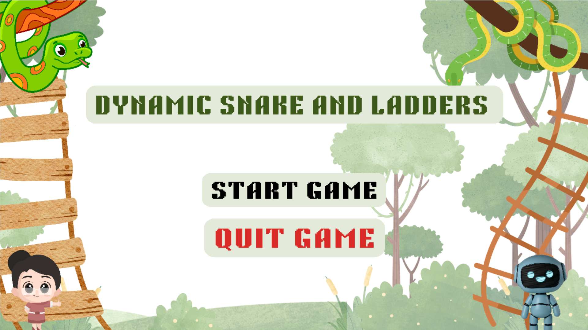
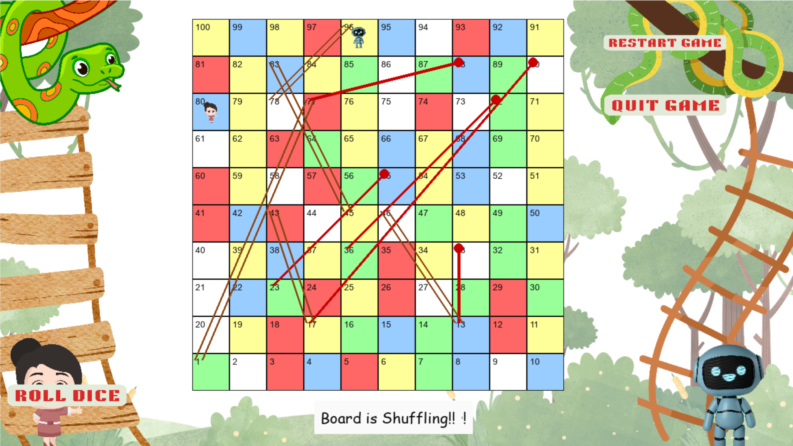

# 🎲 Dynamic Snakes and Ladders

## 🚀 Features

- 🟩 Classic Snakes and Ladders gameplay on a 10x10 board  
- 🤖 AI opponent with decision-making using the Expectiminimax algorithm  
- 🔀 Dynamic board generation — snakes and ladders shuffle every 2 turns  

---

## 🎮 Game Preview

### 🏁 Main Menu  


### 🎲 Gameplay  


---

## 📥 Installation

1. **Clone the repository:**

   ```bash
   https://github.com/gwenchii/Dynamic_Snakes_and_Ladders.git
   
2. Install dependencies:
   ```bash
   pip install pygame
4. Run the game
   ``` bash
   python main.py

---

## 👥 Prepared By

**Group 9 | BSCS 3-4**  
- Baluyot, Arron Ken L.  
- Batalla, Stephanie E.  
- Blanquer, Jhoanna Joy S.  
- Serote, Jiro Domingo V.

**2024–2025**
